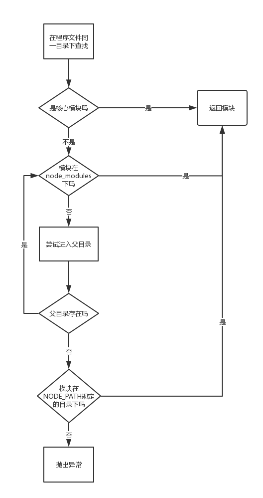
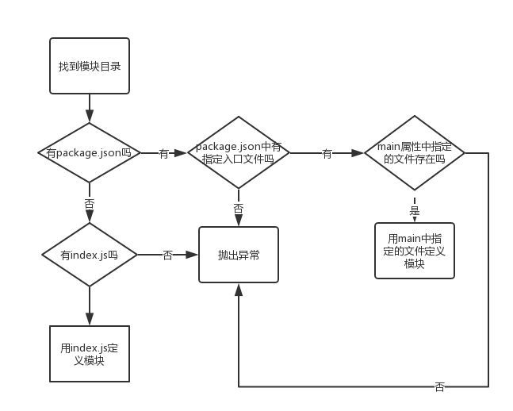

# nodejs实战笔记

[toc]

## 第三章
node的模块系统基于CommonJS规范(www.commonjs.org/specs/modules/1.0/)


3.1 模块机制

模块寻找机制

1.  node_modules文件外
    

2.  node_modeuls文件内
    

3.2 异步编程技术

回调

事件监听

3.3 异步逻辑顺序化

3.3.1 串行流程控制
文章中使用了数组的方式，一次触发push进数组的函数，从而实现串行流程的控制。

由于node支持promise，故使用promise实现流程控制

```js
const fs = require("fs");
const request = require("request");
const htmlparser = require("htmlparser");
const configFilename = "./rss_feeds.txt";


checkForRSSFile()
  .then((filename) => readRSSFile(filename))
  .then((url) => downloadRSSFeed(url))
  .then((rss) => parseRSSFeed(rss))
  .catch(e => {
    console.error(e);
  });


function checkForRSSFile() {
  return new Promise(function (resolve, reject) {
    fs.access(configFilename, function (err) {
      if (err) {
        reject(err);
        return;
      }
      resolve(configFilename);
    })
  })
}

function readRSSFile(configFilename) {
  return new Promise(function (resolve, reject) {
    fs.readFile(configFilename, function (err, feedList) {
      if (err) {
        reject(err);
        return;
      }

      feedList = feedList.toString().replace(/^\s+|\s+$/g, '').split("\n");

      const random = Math.floor(Math.random() * feedList.length);
      resolve(feedList[random]);
    });
  });
}


function downloadRSSFeed(feedUrl) {
  return new Promise(function(resolve, reject) {
    request({uri: feedUrl}, function(err, res, body) {
      if (err || res.statucCode !== 200) {
        reject(err);
        return;
      }
      resolve(body);
    })
  })
}


function parseRSSFeed(rss) {
  return new Promise(function (resolve, reject) {
    const handler = new htmlparser.RssHandler();
    const parser = new htmlparser.Parser(handler);
    parser.parseComplete(rss);
    if (!handler.dom.items.length) {
      reject();
      return;
    }
    const item = handler.dom.items.shift();
  });
}
```

3.3.3 并行流程控制
通过Promise.all实现

```js
const fs = require("fs");
const util = require('util');


const readDir = util.promisify(fs.readdir);
const readFile = util.promisify(fs.readFile);


const tasks = [];
const wordCounter = {};

const filesDir = "./text";


function tasksComplete() {
  for (const i in wordCounter) {
    console.log(`${i}: ${wordCounter[i]}`)
  }
}


function countWordsInText(text) {
  const words = text.toString().toLowerCase().split(/\W+/).sort();
  for (const i in words) {
    const word = words[i];
    if (word) {
      wordCounter[word] = (wordCounter[word]) ? wordCounter[word] + 1 : 1;
    }
  }
}


readDir(filesDir)
  .then(files => {
    files.forEach((file) => {
      const tmp = readFile(`${filesDir}/${file}`).then(text => {
        countWordsInText(text);
      });
      tasks.push(tmp);
    });
    return Promise.all(tasks);
  })
  .then(e => {
    tasksComplete();
  })
  .catch(e => {
    console.error(e);
  });
```
